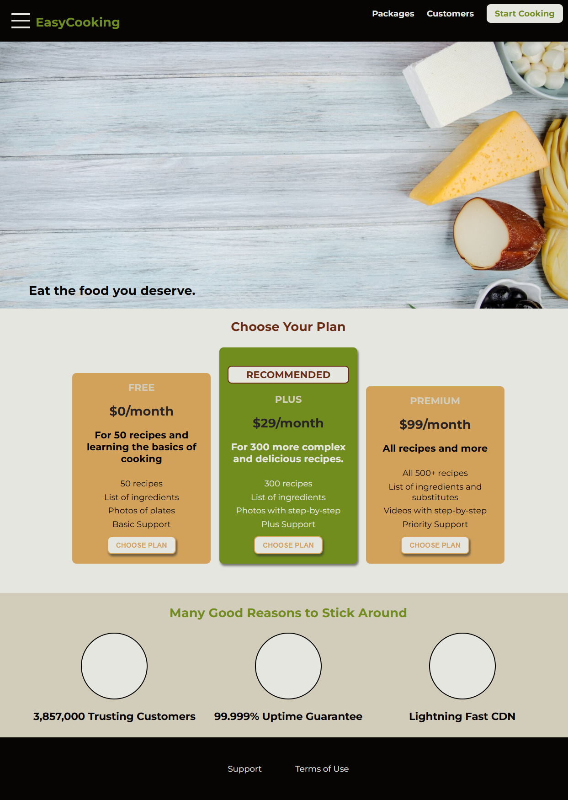

# Easy Cooking Desing

## Introduction
This is a small and very simple project I'm working on to go deeper in CSS concepts and understanding.

The idea is to create a desing to a cooking teachig website, with plans to subscribe to get access to recipes and ingredients used in them.

## How the index page looks so far...

## How Packages page looks so far...

## What do we have so far?

### Index page

#### Hamburger menu
In the index page we have a hamburguer menu that opens a mobile menu, hidden at first. Later this will be shown only at smaller screens.

---

#### Modal

Every time the CHOOSE PLAN button is clicked, we show a modal with a confirmation button to redirect to another page (yet to be created).

#### Reactive buttons and styling

The buttons change color when hover and change the shadow to create an impression that they are being pushed down.

## What's next?

### Alignments

The plans in the index page are not quite aligned yet. In the next steps I intend to make them the same size and responsive to smaller devices.

### Responsiveness

As I said before, the plans are not responsive. That applies to the whole page. Nothing is responsive yet. In the next steps I intend to add responsiveness to the whole app.

### Fix Broken pages

There is a lot to be done, I'm just getting started with this app. The links are broken since I didn't create all the pages yet. I will do that in the next steps.

### Reasons to stick around

The lower session of the index page has empty circles. This is not gonna be like that for long.

### Single Page Application

My goal is to create a single page application to avoid all the duplicated code, and create smaller components with smaller functionalities.
